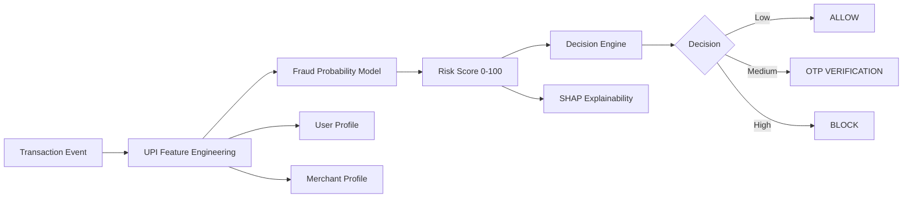

# UPI Transaction Risk Intelligence Platform

FraudSight has been upgraded from a notebook-style binary fraud classifier into a production-inspired fintech risk decisioning project. It now scores UPI transactions on a 0-100 risk scale, explains the drivers behind each score, profiles risky users and merchants, and exposes both a Streamlit fraud operations center and FastAPI scoring APIs.

## Project Overview

The platform simulates the kind of payment-risk workflow used by payment companies and acquiring platforms:

1. Ingest or generate UPI-like transaction telemetry.
2. Engineer behavioral risk signals such as device changes, night activity, velocity, and merchant failure rates.
3. Predict fraud probability with a Random Forest model.
4. Convert probability into a 0-100 risk score.
5. Apply a deterministic decision engine: `ALLOW`, `OTP_VERIFICATION`, or `BLOCK`.
6. Explain model output with SHAP when available, or a feature-importance fallback.
7. Monitor transactions, users, merchants, and model performance in Streamlit.


## Features

- Fraud probability prediction
- Risk score from 0 to 100
- Risk categories: Low, Medium, High
- Rule-based decision engine
- UPI-specific feature engineering
- User risk profiling
- Merchant risk profiling
- Transaction risk simulator
- SHAP explainability with graceful fallback
- Feature importance ranking
- Confusion matrix, ROC curve, and precision-recall curve
- FastAPI endpoints for scoring and monitoring
- Professional Streamlit fraud operations dashboard

## Architecture

```text
project_root/
├── app/
│   ├── api/                 FastAPI routes and schemas
│   ├── dashboard/           Streamlit operations center
│   ├── ml/                  Training, prediction, scoring, explainability
│   ├── profiling/           User and merchant risk profiles
│   ├── rules/               Authorization decision engine
│   ├── utils/               Data loading and UPI feature engineering
│   └── config.py            Shared configuration
├── data/                    Synthetic demo transaction data
├── models/                  Persisted model bundle
├── docs/                    Architecture notes
├── assets/                  Screenshots and visual assets
├── main.py                  FastAPI entry point
└── requirements.txt
```



## UPI Risk Signals

The original dataset referenced by the notebook is not committed to this repository, so the project generates a reproducible synthetic UPI transaction stream when no CSV is supplied.

Synthetic signals include:

- `device_changed`: sampled behavioral signal, elevated in risky cases.
- `location_changed`: sampled location anomaly signal.
- `night_transaction`: derived from transaction hour 23, 0, 1, 2, 3, or 4.
- `failed_attempts`: sampled from a skewed count distribution.
- `transactions_last_hour`: sampled velocity signal.
- `avg_amount_deviation`: transaction amount divided by user average amount.
- `merchant_fraud_rate`: synthetic merchant-level fraud prevalence.
- `merchant_failure_rate`: synthetic merchant failure behavior.
- `merchant_dispute_rate`: synthetic merchant dispute behavior.
- `user_velocity_score`: normalized velocity score from recent activity.
- `device_age_days`: sampled age of the active device binding.
- `account_age_days`: sampled age of the UPI/account relationship.

## Decision Engine

The category and decision thresholds are intentionally auditable. Categories follow the project brief exactly: `0-30` is Low, `31-70` is Medium, and `71-100` is High. The authorization rules use operational thresholds:

| Risk Score | Category | Decision |
| --- | --- | --- |
| 0-29 | Low | `ALLOW` |
| 30-69 | Low/Medium boundary | `OTP_VERIFICATION` |
| 70-100 | Medium/High boundary | `BLOCK` |

Each response includes the risk score, risk category, decision reason, and top risk factors.

## Installation

```bash
python3 -m venv .venv
source .venv/bin/activate
pip install -r requirements.txt
```

## Running Locally

Train or refresh the local demo model:

```bash
python3 -m app.ml.train
```

Run the FastAPI backend:

```bash
uvicorn main:app --reload
```

Run the Streamlit dashboard:

```bash
streamlit run app/dashboard/dashboard.py
```

The first run creates:

- `data/synthetic_upi_transactions.csv`
- `models/risk_model.joblib`

## API Usage

Health check:

```bash
curl http://127.0.0.1:8000/health
```

Score a transaction:

```bash
curl -X POST http://127.0.0.1:8000/score \
  -H "Content-Type: application/json" \
  -d '{
    "amount": 4500,
    "transaction_hour": 23,
    "merchant_category": "gaming",
    "device_changed": true,
    "location_changed": true,
    "failed_attempts": 2,
    "transactions_last_hour": 6,
    "merchant_fraud_rate": 0.18,
    "merchant_failure_rate": 0.16,
    "user_velocity_score": 70
  }'
```

Example response:

```json
{
  "fraud_probability": 0.89,
  "risk_score": 89,
  "risk_level": "High",
  "decision": "BLOCK",
  "reason": "High-risk pattern exceeds the blocking threshold for real-time authorization.",
  "top_risk_factors": ["device_changed", "night_transaction", "merchant_fraud_rate"],
  "user_risk_score": 76,
  "merchant_risk_score": 19
}
```

Other endpoints:

- `POST /simulate`
- `GET /health`
- `GET /metrics`
- `GET /model-info`
- `GET /feature-importance`

## Model Details

The active model is a `RandomForestClassifier` trained through a scikit-learn pipeline with:

- Numeric UPI risk features
- One-hot encoded merchant category and payment instrument
- Balanced class weighting
- Persisted model metadata and evaluation metrics

The original notebook remains in the repository as project history.

## SHAP Explainability

`app/ml/explainability.py` uses SHAP's `TreeExplainer` when the `shap` package is installed. If SHAP is unavailable or fails for a local environment reason, the app automatically falls back to importance-weighted feature contributions so the dashboard and APIs remain usable.

Dashboard explainability views include:

- Top transaction risk drivers
- Waterfall-style contribution chart
- Feature importance chart

## Dashboard Screenshots

Add screenshots to `assets/` after running the dashboard locally. Suggested captures:

- Overview page
- Transaction simulator
- Model explainability
- User and merchant profile views

## Future Enhancements

- Replace synthetic data with streaming UPI event ingestion.
- Add Redis/Kafka-backed velocity features.
- Introduce merchant graph and device graph risk features.
- Add model registry and drift monitoring.
- Deploy API and dashboard behind authentication.
- Add analyst case-management workflow.
