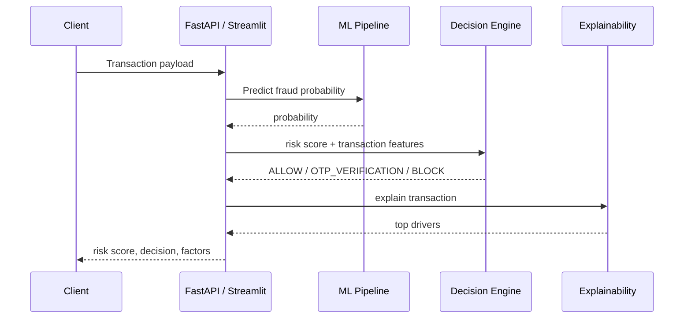

# Architecture Notes

## Runtime Flow

## Module Responsibilities

- `app/utils/helpers.py`: loading, synthetic UPI stream generation, feature engineering.
- `app/ml/train.py`: model training, evaluation metrics, persisted model bundle.
- `app/ml/predict.py`: transaction preparation, probability prediction, risk decision payloads.
- `app/ml/risk_scoring.py`: reusable probability-to-risk-score conversion.
- `app/ml/explainability.py`: SHAP or fallback explanations.
- `app/rules/decision_engine.py`: deterministic authorization policy.
- `app/profiling/user_profile.py`: user risk aggregation and scoring.
- `app/profiling/merchant_profile.py`: merchant risk aggregation and scoring.
- `app/api/routes.py`: production-facing API endpoints.
- `app/dashboard/dashboard.py`: fraud operations center UI.

## Risk Thresholds

The thresholds are intentionally simple and auditable:

- `0-30`: low risk, allow payment.
- `31-70`: medium risk, require OTP verification.
- `71-100`: high risk, block payment.

These can be tuned by business policy, issuer/acquirer appetite, merchant category, or regulatory requirements.

## Data Strategy

The original notebook referenced a local PaySim CSV path that is not portable. To keep the project runnable, the app generates `data/synthetic_upi_transactions.csv` on first use. The generator creates both transaction fields and the behavioral features requested by the project specification.

In a real deployment, the generator would be replaced by event ingestion from a payment switch, fraud event store, device-intelligence system, merchant-risk service, and chargeback/dispute pipeline.
